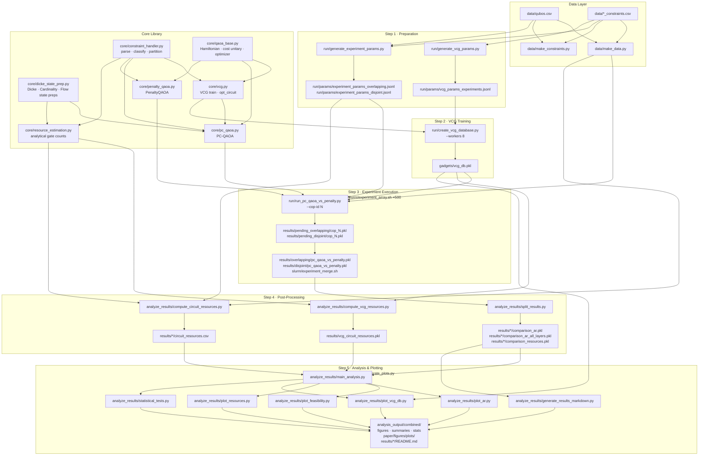

```mermaid
flowchart TD
    subgraph DATA["Data Layer"]
        D1[data/qubos.csv]
        D2[data/*_constraints.csv]
        D3[data/make_data.py]
        D4[data/make_constraints.py]
    end

    subgraph PREP["Step 1 · Preparation"]
        P1[run/generate_vcg_params.py]
        P2[run/params/vcg_params_experiments.jsonl]
        P3[run/generate_experiment_params.py]
        P4[run/params/experiment_params_overlapping.jsonl\nrun/params/experiment_params_disjoint.jsonl]
    end

    subgraph CORE["Core Library"]
        C1[core/constraint_handler.py\nparse · classify · partition]
        C2[core/dicke_state_prep.py\nDicke · Cardinality · Flow state preps]
        C3[core/vcg.py\nVCG train · opt_circuit]
        C4[core/qaoa_base.py\nHamiltonian · cost unitary · optimizer]
        C5[core/pc_qaoa.py\nPC-QAOA]
        C6[core/penalty_qaoa.py\nPenaltyQAOA]
        C7[core/resource_estimation.py\nanalytical gate counts]
    end

    subgraph VCG["Step 2 · VCG Training\nslurm/vcg_train.sh"]
        V1[run/create_vcg_database.py\n--workers 8]
        V2[gadgets/vcg_db.pkl]
    end

    subgraph RUN["Step 3 · Experiment Execution\nslurm/experiment_array.sh ×500"]
        R1[run/run_pc_qaoa_vs_penalty.py\n--cop-id N]
        R2[results/pending_overlapping/cop_N.pkl\nresults/pending_disjoint/cop_N.pkl]
        R3[results/overlapping/pc_qaoa_vs_penalty.pkl\nresults/disjoint/pc_qaoa_vs_penalty.pkl\nslurm/experiment_merge.sh]
    end

    subgraph SPLIT["Step 4 · Post-Processing"]
        S1[analyze_results/split_results.py]
        S2[results/*/comparison_ar.pkl\nresults/*/comparison_ar_all_layers.pkl\nresults/*/comparison_resources.pkl]
        S3[analyze_results/compute_vcg_resources.py]
        S4[results/vcg_circuit_resources.pkl]
        S5[analyze_results/compute_circuit_resources.py]
        S6[results/*/circuit_resources.csv]
    end

    subgraph ANALYSIS["Step 5 · Analysis & Plotting\nanalyze_results/generate_plots.py"]
        A1[analyze_results/main_analysis.py]
        A2[analyze_results/plot_ar.py]
        A3[analyze_results/plot_feasibility.py]
        A4[analyze_results/plot_resources.py]
        A5[analyze_results/plot_vcg_db.py]
        A6[analyze_results/statistical_tests.py]
        A7[analyze_results/generate_results_markdown.py]
        OUT[analysis_output/combined/\nfigures · summaries · stats\npaper/figures/plots/\nresults/*/README.md]
    end

    %% Data flows
    D1 & D2 --> D3 & D4
    D1 & D2 --> P3
    D2 --> P1

    %% Param generation
    P1 --> P2
    P3 --> P4

    %% Core internals
    C4 --> C3
    C4 --> C5 & C6
    C1 --> C3 & C5 & C6 & C7
    C2 --> C5 & C7
    C3 --> C5

    %% VCG training
    P2 --> V1
    C3 --> V1
    V1 --> V2

    %% Experiment run
    P4 --> R1
    V2 --> R1
    D3 --> R1
    C5 & C6 --> R1
    R1 --> R2
    R2 --> R3

    %% Post-processing
    R3 --> S1
    S1 --> S2
    V2 --> S3
    C7 --> S3
    S3 --> S4
    P4 & D3 --> S5
    C7 --> S5
    S5 --> S6

    %% Analysis
    S2 & S4 & S6 --> A1
    V2 --> A5
    A1 --> A2 & A3 & A4 & A5 & A6
    S2 --> A7
    A2 & A3 & A4 & A5 & A6 & A7 --> OUT
```
