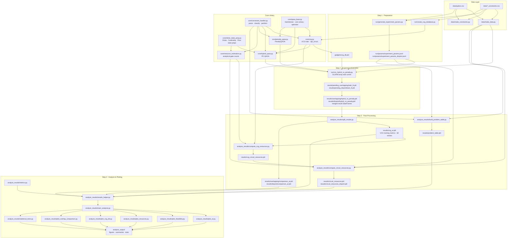

```mermaid
flowchart TD
    subgraph DATA["Data Layer"]
        D1[data/qubos.csv]
        D2[data/*_constraints.csv]
        D3[data/make_data.py]
        D4[data/make_constraints.py]
    end

    subgraph PREP["Step 1 · Preparation"]
        P1[run/generate_experiment_params.py]
        P2[run/params/experiment_params.jsonl\nrun/params/experiment_params_disjoint.jsonl]
        P3[run/create_vcg_database.py]
        P4[gadgets/vcg_db.pkl]
    end

    subgraph CORE["Core Library"]
        C1[core/constraint_handler.py\nparse · classify · partition]
        C2[core/dicke_state_prep.py\nDicke · Cardinality · Flow state preps]
        C3[core/vcg.py\nVCG train · opt_circuit]
        C4[core/qaoa_base.py\nHamiltonian · cost unitary · optimizer]
        C5[core/hybrid_qaoa.py\nPC-QAOA]
        C6[core/penalty_qaoa.py\nPenaltyQAOA]
        C7[core/resource_estimation.py\nanalytical gate counts]
    end

    subgraph RUN["Step 2 · Experiment Execution"]
        R1[run/run_hybrid_vs_penalty.py\nSLURM array task runner]
        R2[results/pending_overlapping/task_N.pkl\nresults/pending_disjoint/task_N.pkl]
        R3[results/overlapping/hybrid_vs_penalty.pkl\nresults/disjoint/hybrid_vs_penalty.pkl\nmerged result DataFrames]
    end

    subgraph SPLIT["Step 3 · Post-Processing"]
        S1[analyze_results/split_results.py]
        S2[results/vcg_ar.pkl\nVCG training metrics · 60 entries]
        S3[results/overlapping/comparison_ar.pkl\nresults/disjoint/comparison_ar.pkl]
        S4[analyze_results/compute_vcg_resources.py]
        S5[results/vcg_circuit_resources.pkl]
        S6[analyze_results/compute_circuit_resources.py]
        S7[results/circuit_resources.pkl\nresults/circuit_resources_disjoint.pkl]
        S8[analyze_results/build_problem_table.py]
        S9[results/problem_table.pkl]
    end

    subgraph ANALYSIS["Step 4 · Analysis & Plotting"]
        A1[analyze_results/main_analysis.py]
        A2[analyze_results/plot_ar.py]
        A3[analyze_results/plot_feasibility.py]
        A4[analyze_results/plot_resources.py]
        A5[analyze_results/plot_vcg_db.py]
        A6[analyze_results/plot_overlap_comparison.py]
        A7[analyze_results/statistical_tests.py]
        A8[analyze_results/metrics.py]
        A9[analyze_results/results_helper.py]
        OUT[analysis_output/\nfigures · summaries · stats]
    end

    %% Data flows
    D1 & D2 --> D3 & D4
    D1 & D2 --> P1
    P1 --> P2
    D2 --> P3
    P3 --> C3
    C3 --> P4

    %% Core internals
    C4 --> C3
    C4 --> C5 & C6
    C1 --> C3 & C5 & C6 & C7
    C2 --> C5 & C7
    C3 --> C5

    %% Experiment run
    P2 --> R1
    P4 --> R1
    D3 --> R1
    C5 & C6 --> R1
    R1 --> R2
    R2 --> R3

    %% Post-processing
    R3 --> S1
    S1 --> S2 & S3
    S2 --> S4
    C3 --> S4
    C7 --> S4
    S4 --> S5
    P2 & D3 --> S6
    C7 --> S6
    S5 --> S6
    S6 --> S7
    P2 & D3 & C1 --> S8
    S8 --> S9

    %% Analysis
    S2 & S3 & S7 & S9 --> A9
    A8 --> A9
    A9 --> A1
    A1 --> A2 & A3 & A4 & A5 & A6 & A7
    A2 & A3 & A4 & A5 & A6 & A7 --> OUT
```
