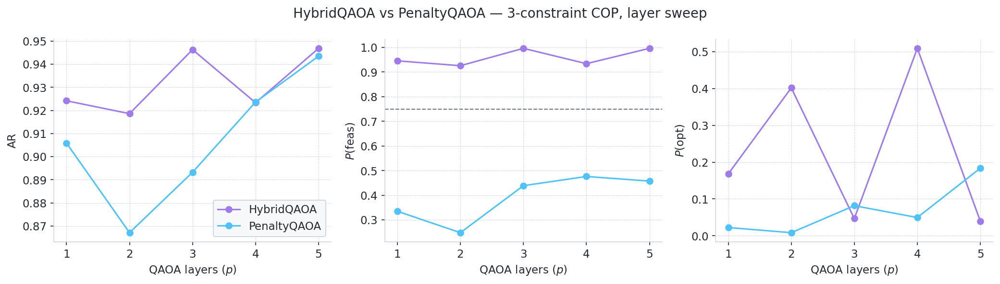

# HybridQAOA Example Results

Results from running `examples/example_hybrid.py`.

---

## Problem

**7 decision variables** (`x_0 … x_6`), 3 constraints, random 7×7 QUBO.

| Label | Constraint | Variables | Handling |
|---|---|---|---|
| A | `x_0 + x_1 + x_2 == 1` | {0, 1, 2} | Structural — Dicke state prep (exact) |
| B | `6*x_3 + 2*x_4 + 2*x_5 <= 3` | {3, 4, 5} | Structural — VCG gadget (trained) |
| C | `x_1 + x_4 + x_6 <= 1` | {1, 4, 6} | Penalized (overlaps A and B) |

Constraint A uses an exact Dicke circuit (unit coefficients, equality).
Constraint B is a weighted knapsack — non-unit coefficients make it ineligible for exact
prep, so a VCG is trained and used as the initial state + Grover mixer target.
Constraint C deliberately overlaps A (`x_1`) and B (`x_4`), so it cannot be encoded
structurally without coupling the two gadgets; it is penalized instead.

**Optimal feasible solution:** `x = 1000100`  (cost = −11.0)
**Penalty weight δ:** 55.0

---

## Results (layer sweep p = 1 … 5)

| p | Method | AR | P(feasible) | P(optimal) |
|---|---|---|---|---|
| 1 | **HybridQAOA** | **0.9242** | **0.9456** | 0.1682 |
| 1 | PenaltyQAOA | 0.9059 | 0.3350 | 0.0224 |
| 2 | **HybridQAOA** | **0.9186** | **0.9258** | **0.4017** |
| 2 | PenaltyQAOA | 0.8671 | 0.2481 | 0.0085 |
| 3 | **HybridQAOA** | **0.9463** | **0.9963** | 0.0469 |
| 3 | PenaltyQAOA | 0.8932 | 0.4389 | 0.0818 |
| 4 | **HybridQAOA** | 0.9234 | **0.9341** | **0.5090** |
| 4 | PenaltyQAOA | 0.9236 | 0.4763 | 0.0496 |
| 5 | **HybridQAOA** | **0.9469** | **0.9963** | 0.0396 |
| 5 | PenaltyQAOA | 0.9435 | 0.4575 | 0.1837 |

HybridQAOA maintains P(feasible) ≥ 0.93 across all layers vs ≤ 0.48 for PenaltyQAOA,
demonstrating that structural constraint encoding consistently keeps the circuit in the
feasible subspace regardless of layer count.

---

## Figures

### Layer sweep: AR / P(feasible) / P(optimal) vs p



### Measurement distributions at p=5 (top 20 outcomes)


---

## Workflow

The full end-to-end workflow shown in `example_hybrid.py`:

```python
from core import constraint_handler as ch
from core.hybrid_qaoa import HybridQAOA
from core.penalty_qaoa import PenaltyQAOA
from core.qaoa_base import ising_hamiltonian_extremes
from analyze_results.results_helper import ResultsCollector
from analyze_results.metrics import compute_comparison_metrics
from analyze_results.plot_feasibility import plot_layer_sweep, plot_outcome_distributions

parsed = ch.parse_constraints(all_constraints)
structural_indices, penalty_indices = ch.partition_constraints(parsed, strategy='auto')

# Warm-started layer sweep p = 1 .. MAX_LAYERS
prev_h_angles, prev_p_angles = None, None
rows = []
for p in range(1, MAX_LAYERS + 1):
    hybrid = HybridQAOA(qubo=Q, all_constraints=parsed,
                        structural_indices=structural_indices,
                        penalty_indices=penalty_indices, n_layers=p, ...)
    opt_cost_h, opt_angles_h = hybrid.optimize_angles(prev_layer_angles=prev_h_angles)
    counts_h = hybrid.do_counts_circuit(shots=SHOTS)
    C_min_h, C_max_h = ising_hamiltonian_extremes(hybrid.problem_ham, hybrid.all_wires)
    m_h = compute_comparison_metrics(counts_h, opt_cost_h, C_max_h, C_min_h, ...)
    rows.append({'method': 'HybridQAOA', 'layer': p, **m_h})
    prev_h_angles = jnp.array(opt_angles_h)
    # ... same for PenaltyQAOA ...

df = pd.DataFrame(rows)
plot_layer_sweep(df, save_path="examples/figures/hybrid_example_layer_sweep.png")
plot_outcome_distributions(counts={...}, ...)
```
