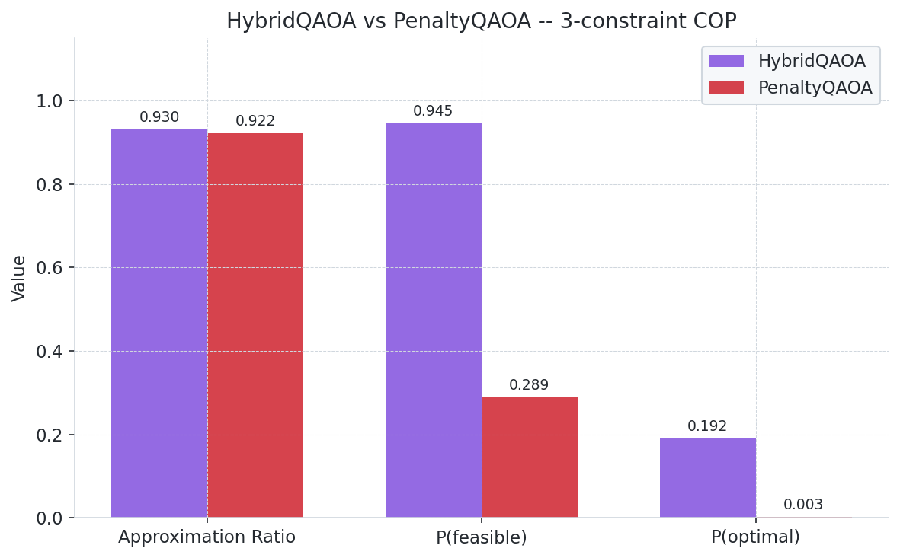
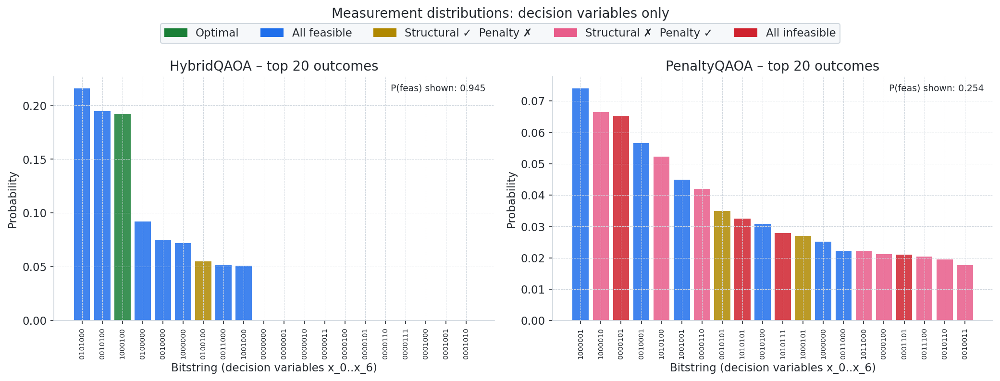

# HybridQAOA Example Results

Results from running `examples/example_hybrid.py`.

---

## Problem

**7 decision variables** (`x_0 … x_6`), 3 constraints, random 7×7 QUBO.

| Label | Constraint | Variables | Handling |
|---|---|---|---|
| A | `x_0 + x_1 + x_2 == 1` | {0, 1, 2} | Structural — Dicke state prep (exact) |
| B | `2*x_3 + 1*x_4 + 4*x_5 <= 2` | {3, 4, 5} | Structural — VCG gadget (trained) |
| C | `x_1 + x_4 + x_6 <= 1` | {1, 4, 6} | Penalized (overlaps A and B) |

Constraint A uses an exact Dicke circuit (unit coefficients, equality).
Constraint B is a weighted knapsack — non-unit coefficients make it ineligible for exact
prep, so a VCG is trained and used as the initial state + Grover mixer target.
Constraint C deliberately overlaps A (`x_1`) and B (`x_4`), so it cannot be encoded
structurally without coupling the two gadgets; it is penalized instead.

**Optimal feasible solution:** `x = 1000100`  (cost = −11.0)
**Penalty weight δ:** 55.0

---

## Results

| Method | AR | P(feasible) | P(optimal) |
|---|---|---|---|
| **HybridQAOA** | **0.9304** | **0.9450** | **0.1920** |
| PenaltyQAOA | 0.9221 | 0.2893 | 0.0031 |

HybridQAOA enforces constraints A and B structurally, so nearly all measured
bitstrings satisfy them (P(feasible) = 0.945 vs 0.289 for PenaltyQAOA).
P(optimal) is ~62× higher for HybridQAOA at p=1.

---

## Figures

### Metric comparison



### Measurement distributions (top 20 outcomes)



---

## Workflow

The full end-to-end workflow shown in `example_hybrid.py`:

```python
from core import constraint_handler as ch
from core.hybrid_qaoa import HybridQAOA
from core.penalty_qaoa import PenaltyQAOA
from analyze_results.results_helper import (
    ResultsCollector, collect_hybrid_data, collect_penalty_data,
)
from analyze_results.metrics import compute_comparison_metrics
from analyze_results.plot_feasibility import plot_method_comparison, plot_outcome_distributions

# Parse and partition constraints
parsed = ch.parse_constraints(all_constraints)

# HybridQAOA: A and B structural, C penalized
hybrid = HybridQAOA(qubo=Q, all_constraints=parsed,
                    structural_indices=[0, 1], penalty_indices=[2], ...)

row_h = collect_hybrid_data(all_constraints, hybrid, qubo_string, min_val=min_val)

# PenaltyQAOA baseline: all constraints penalized
penalty = PenaltyQAOA(qubo=Q, constraints=all_constraints, ...)
row_p = collect_penalty_data(all_constraints, penalty, qubo_string, min_val=min_val)

# Save
collector = ResultsCollector()
collector.add(row_h)
collector.add(row_p)
collector.save("examples/results/example_hybrid_results.pkl")

# Plot
m_hybrid  = compute_comparison_metrics(row_h['counts'][0], ...)
m_penalty = compute_comparison_metrics(row_p['counts'][0], ...)
plot_method_comparison({'HybridQAOA': m_hybrid, 'PenaltyQAOA': m_penalty}, ...)
plot_outcome_distributions(counts={...}, constraints=all_constraints, ...)
```
