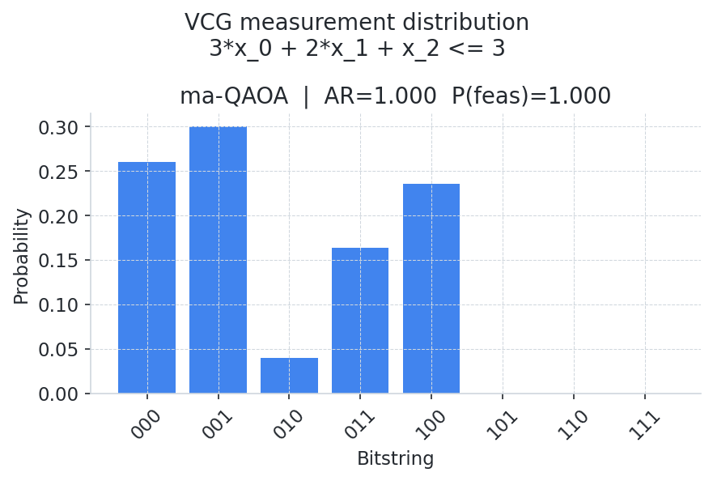

# VCG Example Results

Results from running `examples/example_vcg.py`.

---

## Problem

**Constraint:** `3*x_0 + 2*x_1 + x_2 <= 3`  (3-variable knapsack)

Feasible assignments (5 of 8 total):

| Bitstring | LHS | Feasible |
|---|---|---|
| `000` | 0 | ✓ |
| `001` | 1 | ✓ |
| `010` | 2 | ✓ |
| `011` | 3 | ✓ |
| `100` | 3 | ✓ |
| `101` | 4 | ✗ |
| `110` | 5 | ✗ |
| `111` | 6 | ✗ |

---

## Training

The VCG is trained with the two-stage procedure:

1. **Stage 1 — QAOA p=1 warm-start** (5 restarts × 150 steps, 2 parameters)
2. **Stage 2 — ma-QAOA layer sweep** (20 restarts × 200 steps per layer, independent γ per Pauli term and β per qubit)

Training stops when AR ≥ 0.999 **and** normalised entropy ≥ 0.9 (amplitude spread over feasible states).

| Metric | Value |
|---|---|
| AR | **1.0000** |
| P(feasible) | **1.0000** |
| Layers (p) | 3 |
| Train time | ~66 s |

---

## Measurement Distribution



All probability mass falls on the 5 feasible bitstrings (blue bars).
Infeasible bitstrings (red) carry zero amplitude.

---

## Workflow

The full end-to-end workflow shown in `example_vcg.py`:

```python
from core.vcg import VCG
from analyze_results.results_helper import ResultsCollector, collect_vcg_data
from analyze_results.plot_feasibility import plot_vcg_counts

gadget = VCG(constraints=["3*x_0 + 2*x_1 + x_2 <= 3"], ...)
gadget.train()

row = collect_vcg_data(gadget, constraint_type="knapsack", skip_optimize=True)

collector = ResultsCollector()
collector.add(row)
collector.save("examples/results/example_vcg_results.pkl")

plot_vcg_counts(rows=[row], constraint_label="3*x_0 + 2*x_1 + x_2 <= 3",
                save_path="examples/figures/vcg_example_counts.png")
```
