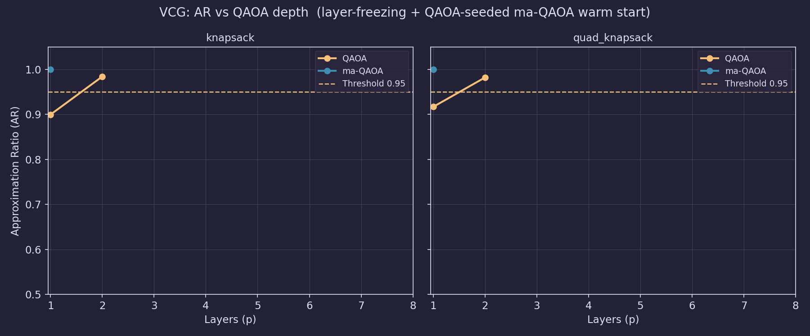
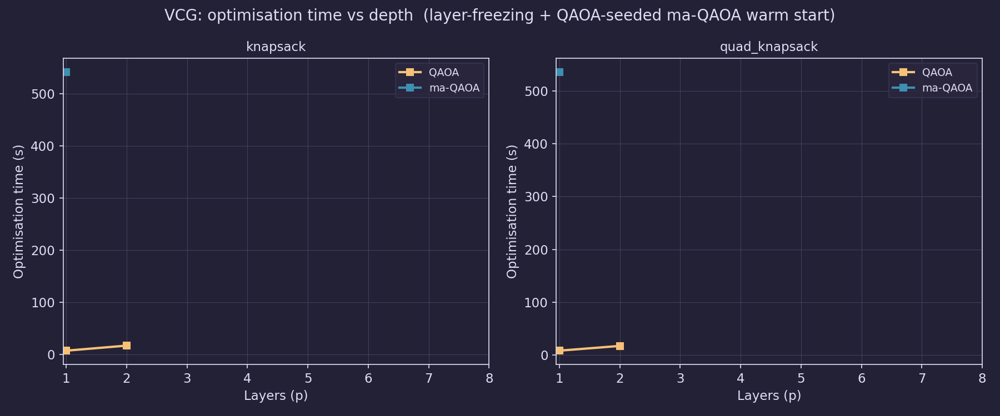
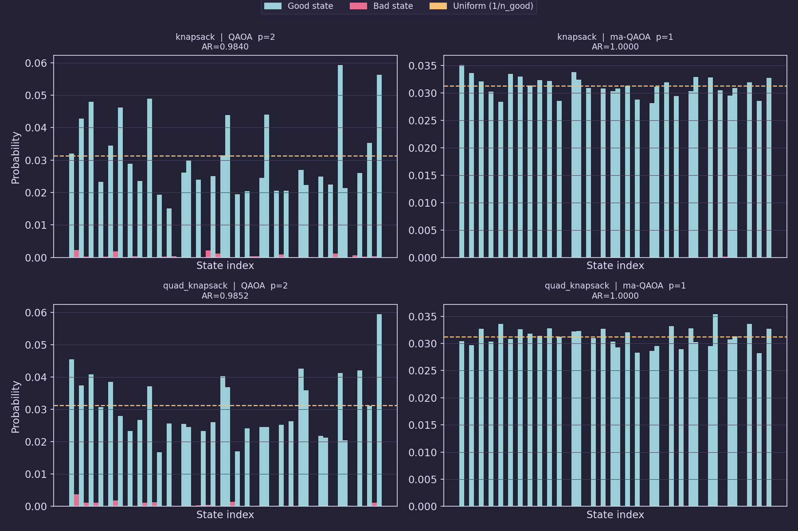

# VCG Training: QAOA vs ma-QAOA — Current State and Recommendations

> **Status:** Initial sweep complete on 5-variable linear and quadratic
> knapsack constraints.  Results, figures, and the full sweep script live in
> `examples/test_vcg_layers.py` and `examples/results/vcg_layer_sweep.pkl`.

---

## 1. What is a VCG?

A **Variational Constraint Gadget (VCG)** is a small QAOA circuit trained so
that its ground state is the uniform superposition over all bitstrings
satisfying a given constraint.  Once trained it is used inside HybridQAOA as:

- the **initial state** (structured state-preparation replacing |+⟩^n), and
- the **Grover mixer** (reflecting about the feasible subspace).

This keeps the outer QAOA search within the feasible region from the start,
rather than penalising infeasibility in the cost Hamiltonian.

---

## 2. VCG Construction Process

### Step 1 — Parse the constraint

The constraint string (e.g. `5*x_0 + 10*x_1 + 1*x_2 + 9*x_3 + 6*x_4 <= 19`)
is parsed into coefficient maps plus an operator and RHS.  Variable indices
determine which wires carry the decision variables.  One additional **flag
qubit** per constraint marks whether an assignment satisfies the constraint.

### Step 2 — Build the constraint Hamiltonian

A truth table is built over all `2^(n_x + n_c)` states:

- For each assignment of the `n_x` decision variables, evaluate the constraint
  and set the flag qubit to 0 (satisfied) or 1 (violated).
- Label every *valid* state (variables + matching flag) with eigenvalue **−1**;
  label every *invalid* state (impossible flag assignment) with **+1**.
- Compute the Pauli decomposition via a **Walsh-Hadamard transform (WHT)**:

```
H_constraint = Σ_k  w_k · P_k    (Z-only Pauli terms)

c_S = (1/2^n) · Σ_x  outcomes[x] · (−1)^{popcount(x & S)}
```

Because the Hamiltonian is diagonal, all Pauli terms are products of Z
operators and therefore **mutually commute**.  The WHT computes their
coefficients in O(n · 2^n) time and O(2^n) memory — far more efficient than
constructing the full `2^n × 2^n` matrix and calling `qml.pauli_decompose`
(O(4^n) in both time and memory, which runs out of RAM for n ≳ 13).

The number of non-trivial terms (`num_gamma`) drives the cost-layer gate
count and determines how many independent angles ma-QAOA needs.

> For the 5-variable knapsack tested here: 6 qubits total (5 vars + 1 flag),
> 64 states, 32 good / 32 bad, **32 Pauli terms**.

### Step 3 — Build the QAOA circuit

```
|+⟩^n → [Cost(γ) · Mixer(β)]^p → measure
```

| Component | Details |
|---|---|
| Initialisation | Hadamard on every qubit |
| Cost layer | `MultiRZ(w_k · γ_k, wires)` for each non-identity Pauli term k |
| Mixer layer | `RX(β_i, wire_i)` for each qubit i (X-mixer) |
| Depth | p = `n_layers` repetitions |

For `decompose=False` (QAOA only), the cost layer is instead a single
`DiagonalQubitUnitary(exp(−iγ · outcomes))` — mathematically equivalent since
all Z-terms commute, but incompatible with ma-QAOA which needs per-term angles.

### Step 4 — Angle strategies

| Strategy | Params per layer | Free angles |
|---|---|---|
| **QAOA** | 2 | One shared γ (all Pauli terms), one shared β (all qubits) |
| **ma-QAOA** | `num_gamma + num_beta` | Independent γ per Pauli term, β per qubit |

QAOA is a **special case** of ma-QAOA where all γ values are forced equal and
all β values are forced equal.  ma-QAOA's optimal cost is therefore always
≤ QAOA's optimal cost (ma-QAOA can only do better or the same).

For the 5-variable knapsack: QAOA has 2 params/layer, ma-QAOA has
32 + 6 = **38 params/layer**.

### Step 5 — Optimisation

Two pitfalls discovered (and fixed) during this work:

#### Pitfall A — Layer-freezing for QAOA

An early implementation froze the first p layers' angles when adding a new
layer, optimising only the (p+1)-th layer.  This makes the parameter count
constant at k regardless of depth — useful for ma-QAOA where k=38 — but
for QAOA it is **unnecessarily restrictive**.

The optimal angles for a p-layer QAOA circuit are generally *not* the same as
the optimal (p-1)-layer angles with a new layer appended; the earlier layers
need to adjust when a new one is added.  With freezing, QAOA appeared to
plateau hard from p=2 onward:

| Constraint | QAOA AR (frozen) | QAOA AR (joint) |
|---|---|---|
| knapsack | 0.9048 at p=8 | **0.9840 at p=2** |
| quad_knapsack | 0.9210 at p=8 | **0.9852 at p=2** |

**Fix:** For QAOA, re-optimise *all* p·2 parameters jointly at every depth,
using the previous depth's optimal angles as a warm-start initialisation.
At p=8 this is still only 16 parameters — trivial to optimise.

Layer-freezing is **retained for ma-QAOA** where it is beneficial: with 38
params per new layer, freezing keeps the active parameter count at 38
regardless of depth rather than growing to 38p.

#### Pitfall B — Equal optimization budget across unequal parameter spaces

Running QAOA (2 params) and ma-QAOA (38 params) with the same `NUM_RESTARTS`
and `STEPS` budget is not a fair comparison.  With 5 restarts × 100 steps,
random initialisation in [−2π, 2π]^38 barely explores the ma-QAOA landscape.

**Fix:** Scale the budget by parameter count.
Currently: QAOA uses 5 restarts × 150 steps; ma-QAOA uses 20 restarts × 200
steps.

#### QAOA-seeded warm start for ma-QAOA

Run the QAOA sweep first.  For each depth p, broadcast the QAOA optimal
angles to ma-QAOA format (repeat γ across all 32 terms, β across all 6
qubits) and use this as the first-restart starting point for ma-QAOA.
Subsequent restarts remain random, providing diversity.

This guarantees ma-QAOA starts from a point that is *at least as good as
QAOA*, giving the optimiser a strong prior while still allowing it to find
the fully generalised optimum.

---

## 3. Results

### Summary table

| Constraint | Strategy | Layers p* | AR | Opt. time |
|---|---|---|---|---|
| knapsack | QAOA | 2 | 0.9840 | ~25 s total |
| knapsack | **ma-QAOA** | **1** | **1.0000** | ~542 s |
| quad_knapsack | QAOA | 2 | 0.9852 | ~26 s total |
| quad_knapsack | **ma-QAOA** | **1** | **1.0000** | ~536 s |

AR threshold: 0.95.  Both strategies pass it; ma-QAOA hits the exact ground
state.

### AR vs circuit depth



QAOA reaches the threshold at p=2 and saturates — adding more layers provides
no benefit.  ma-QAOA hits AR=1.0 at p=1 and stops.  The QAOA ceiling (~0.985)
is real: the shared-angle constraint limits expressibility regardless of depth.

### Optimisation time vs circuit depth



QAOA is fast: ~8 s at p=1, ~17 s at p=2.  ma-QAOA takes ~540 s at p=1 due to
the 19× larger parameter space and higher restart count.  With layer-freezing,
ma-QAOA time scales roughly linearly with depth (not quadratically) since only
38 params are optimised at each new layer.

### Measurement distributions (best layer per run)



For ma-QAOA the good (foam) states carry essentially all probability mass,
confirming AR=1.0.  For QAOA the distribution is wider but clearly biased
toward good states.

---

## 4. Key Findings

1. **ma-QAOA strictly dominates QAOA on expressibility** — AR=1.0 at p=1 vs
   AR≈0.985 at p=2 for QAOA.  This is expected theoretically (QAOA ⊂ ma-QAOA)
   but required proper optimisation to observe empirically.

2. **QAOA has a structural ceiling** — even with joint optimisation and
   unlimited depth, the shared-angle constraint caps AR below 1.0 for these
   Hamiltonians.  The ceiling is ~0.985, not 1.0, because the single γ cannot
   independently weight all 32 Pauli terms.

3. **Layer-freezing is harmful for QAOA but beneficial for ma-QAOA** — the
   lesson generalises: freezing is useful only when the parameter count per
   layer is large relative to the optimization budget.

4. **Warm-starting ma-QAOA from QAOA is critical** — without it, 20 restarts
   in a 38-dimensional space is still insufficient to reliably find the ground
   state.  With it, ma-QAOA converges reliably at p=1.

5. **Training cost is a one-time expense** — the 540 s ma-QAOA training is
   cached in `GadgetDatabase`.  HybridQAOA looks up the stored gadget and
   reuses it at no additional cost.

---

## 5. Recommended Approach

For production VCG creation:

```python
# 1. Run QAOA sweep first (fast, warm-starts ma-QAOA)
gadget_qaoa = VCG(..., angle_strategy='QAOA', decompose=False,
                  num_restarts=5, steps=150, learning_rate=0.05)
opt_cost, qaoa_angles = gadget_qaoa.optimize_angles(
    gadget_qaoa.do_evolution_circuit,
    prev_layer_angles=prev_qaoa_angles,   # joint re-opt, None at p=1
)

# 2. Run ma-QAOA seeded from QAOA solution
gadget_ma = VCG(..., angle_strategy='ma-QAOA', decompose=True,
                num_restarts=20, steps=200, learning_rate=0.05)
opt_cost, _ = gadget_ma.optimize_angles(
    gadget_ma.do_evolution_circuit,
    starting_angles_from_qaoa=qaoa_angles,  # broadcasts γ, β
)
```

**Decision guide:**

| Situation | Recommended strategy |
|---|---|
| Need AR ≥ 0.95, time budget < 1 min | QAOA p=2, joint re-opt |
| Need AR = 1.0 or maximum quality | ma-QAOA p=1, QAOA warm-start |
| Constraint has few Pauli terms (< 10) | Either; both will converge quickly |
| Constraint has many Pauli terms (> 20) | ma-QAOA with scaled restarts |
| Gadget will be reused in HybridQAOA | Invest in ma-QAOA; pay once, reuse many times |

---

## 6. Open Questions / Future Work

- **Scaling to larger n** — all tests here are n=5 variables.  The 2^(n+1)
  truth table and Pauli decomposition become expensive beyond n≈10–12.  The
  `hamiltonian_time` field in the results DataFrame tracks this cost.

- **Optimiser alternatives** — Adam with random restarts works but is not
  ideal for a 38-dimensional landscape.  L-BFGS-B (gradient + Hessian
  approximation) or SPSA (gradient-free, noise-robust) could converge faster.
  Bayesian optimisation over the restart space is another avenue.

- **Coefficient-magnitude pruning** — the 32 Pauli terms have varying weights.
  Dropping near-zero terms reduces gate count and parameter count, potentially
  making the landscape easier to optimise.  Worth benchmarking for larger n
  where the full decomposition becomes expensive.

- **Generalising layer-freezing to partial freezing** — rather than freezing
  all previous layers, one could apply a small learning-rate "fine-tune" to
  earlier layers while optimising the new layer at full rate.  This could
  recover the efficiency of freezing while avoiding the expressibility loss.

- **Warm-start depth transfer** — if ma-QAOA p=1 fails for a hard constraint,
  the p=2 layer-freezing warm-start currently uses QAOA p=2's second layer as
  the new-layer seed.  Experimenting with random or zero initialisation for
  the new layer might perform differently.
