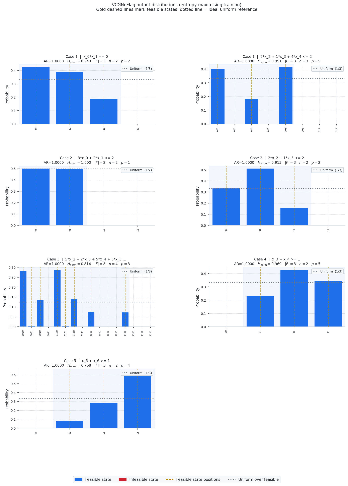
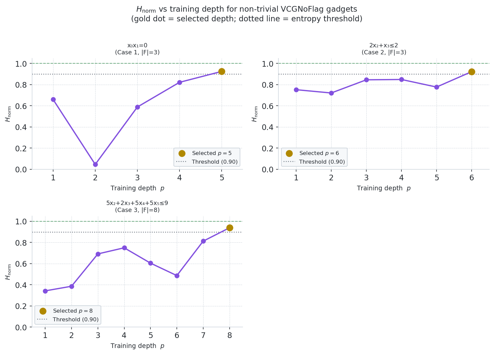
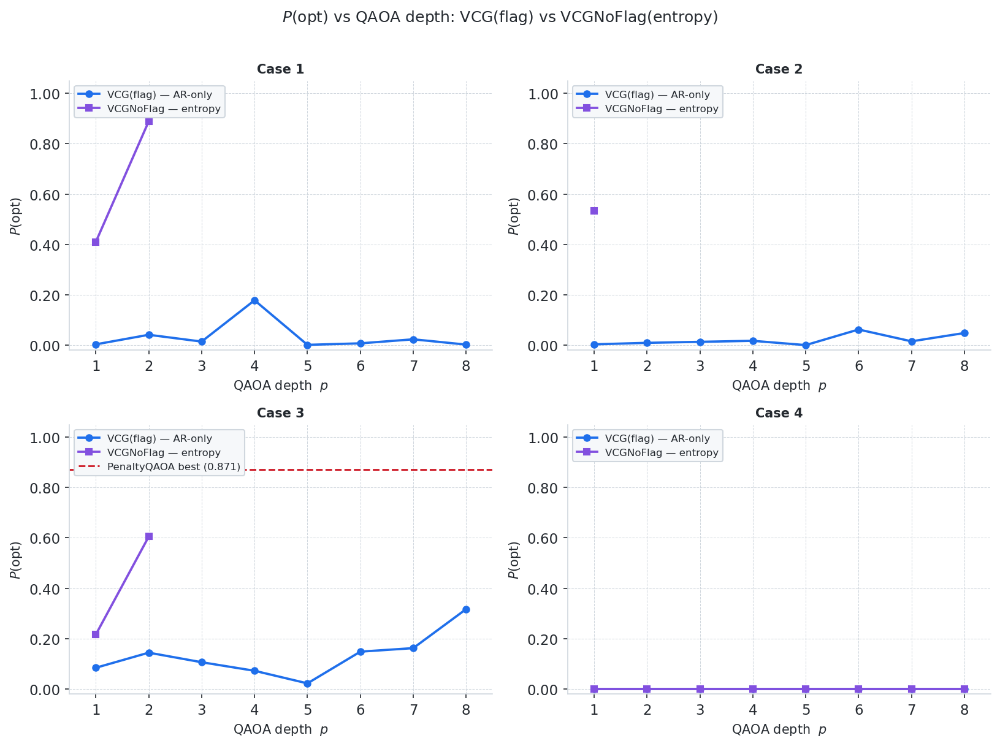
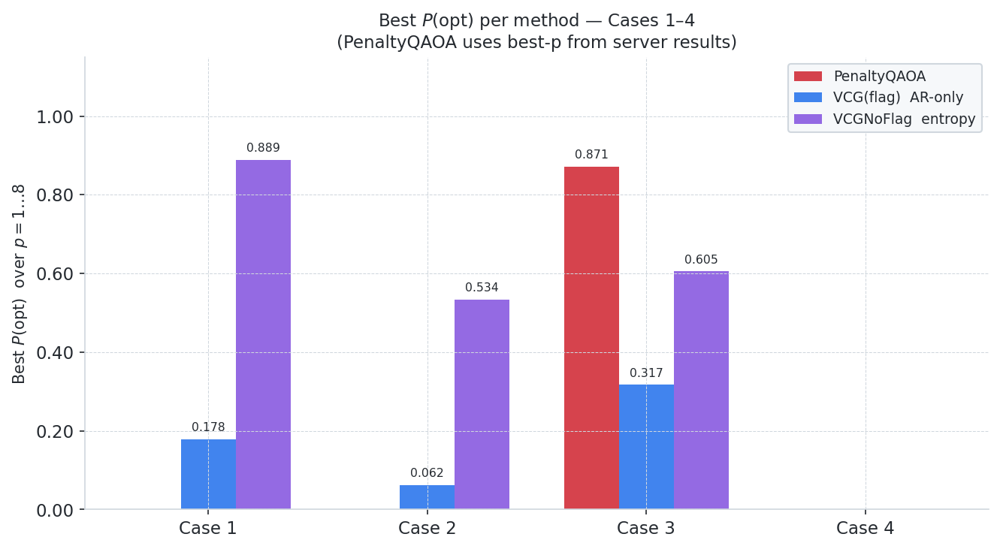

# Results Tracking

**Goal**: Show HybridQAOA as the better method overall.
**Metrics**: P(feas) and P(opt) — AR is not directly comparable across methods
due to Hamiltonian scale differences (PenaltyQAOA inflates C_max 10–100× via
penalty terms).  AR_feas (feasibility-conditioned) is the fair replacement;
pipeline integration done.
**Bold convention**: best value per column in each table.

---

## Baseline — Server run results

Jobs 245203 / 245206, VCG (flag) gadgets, STEPS=50, restarts=10.
These are the worst-performing HybridQAOA configurations — the starting point
all subsequent changes are measured against.

> **Note**: Cases 1 and 3 show P(feas)=0.000 for HybridQAOA because the
> flag-based VCG knapsack gadgets achieved AR≈0.73 (27% infeasible amplitude).
> The Grover mixer reflects about this corrupted state and cannot escape it.

| Case | Method      | best p | P(feas) | P(opt) |
|------|-------------|--------|---------|--------|
| 1    | HybridQAOA  | 5      | 0.000   | 0.000  |
| 1    | PenaltyQAOA | 3      | 0.495   | 0.043  |
| 2    | HybridQAOA  | 4      | 0.193   | 0.037  |
| 2    | PenaltyQAOA | 2      | 0.781   | 0.003  |
| 3    | HybridQAOA  | 5      | 0.000   | 0.000  |
| 3    | PenaltyQAOA | 3      | 0.886   | 0.871  |
| 4    | HybridQAOA  | 5      | 0.732   | 0.685  |
| 4    | PenaltyQAOA | 2      | 0.943   | 0.929  |

Case 4 (Dicke-only, no VCG gadget) shows that HybridQAOA can compete when state
prep is exact.  The knapsack VCG gadget is the primary bottleneck in Cases 1–3.

---

## Focus Cases

Six cases used throughout; constraints, gadget assignments, and key parameters.
All runs: STEPS=150, restarts=20, MAX\_LAYERS=8, SHOTS=20k, stop at P(opt)≥0.5.

### Cases 1–4 (disjoint constraints, no penalized variables)

| # | Name | n | Constraints | Gadgets | \|F\| | f\* |
|---|------|---|-------------|---------|------|-----|
| 1 | indep\_set+knapsack+cardinality | 7 | `x_0*x_1==0`, `2x_2+x_3+4x_4<=2`, `x_5+x_6==2` | VCG×2 + Dicke | 12 | −7 |
| 2 | knapsack+knapsack+cardinality | 7 | `3x_0+2x_1<=2`, `2x_2+x_3<=2`, `x_4+x_5+x_6>=3` | VCG×2 + X-gate | 2 | −23 |
| 3 | cardinality+knapsack | 6 | `x_0+x_1>=2`, `5x_2+2x_3+5x_4+5x_5<=9` | X-gate + VCG | 8 | −18 |
| 4 | cardinality+cardinality | 5 | `x_0+x_1+x_2==1`, `x_3+x_4>=1` | Dicke + VCG | 9 | −8 |

### Cases 5–6 (overlapping variable sets → one constraint penalized)

| # | Name | n | Structural constraints | Penalized | λ\_tight | \|F\| | f\* |
|---|------|---|----------------------|-----------|---------|------|-----|
| 5 | card+card(pen)+card\_geq | 7 | `x_0+x_1+x_2==1` (Dicke), `x_5+x_6>=1` (VCG) | `x_0+x_3+x_4==1` (shares x_0) | 4 | 15 | −14 |
| 6 | knapsack(pen)+card\_leq+card | 7 | `x_1+x_2+x_3<=2` (LEQ), `x_4+x_5+x_6==2` (Dicke) | `3x_0+2x_1<=2` (shares x_1) | 8 | 21 | −21 |

---

## Changes

### Change 1 — VCG replaces flag-based VCG  [`core/vcg.py`]

**Problem**: Flag-based VCG achieves AR≈0.73 for knapsack constraints — 27% of
the initial state amplitude sits in infeasible territory.  The Grover mixer
reflects about this corrupted state and cannot confine output to feasible space.

**Fix**: New `VCG` class.  No ancilla qubit; Hamiltonian assigns eigenvalue
−1 to feasible states and +1 to infeasible ones, so AR=1.0 guarantees all
amplitude is feasible.  Three preparation modes:
- **Zero feasible states**: raises `ValueError` at init.
- **One feasible state**: X-gate preparation, depth=0, no training required.
- **Many feasible states**: QAOA with WHT Pauli decomposition.

**Gadget comparison** (`2*x_2+x_3+4*x_4<=2`, standalone, 10k shots):

| Gadget     | AR     | P(feas) | Qubits |
|------------|--------|---------|--------|
| VCG (flag) | 0.7311 | 0.4778  | 4      |
| VCG  | 1.0000 | 1.0000  | 3      |

**Partition fix**: `partition_constraints` now enforces disjoint variable sets
correctly — exact preps (Dicke/LEQ/Flow) are assigned first, then remaining
constraints become structural only if their variable set is disjoint from all
already-claimed variables.  Overlapping constraints are penalized.

---

### Change 2 — Feasibility-conditioned AR metric  [`analyze_results/metrics.py`]

**Problem**: Raw AR is not comparable — PenaltyQAOA inflates C\_max ~100× via
penalty terms, making its AR appear artificially high.

**Fix**: `ar_feasibility_conditioned()` in `metrics.py`:

    AR_feas = (f_max_F − E[f(x) : x∈F]) / (f_max_F − f*)

Undefined when P(feas)=0.  Pipeline integration **done**: `split_results.py`
computes AR\_feas at split time; `plot_ar.py` adds `plot_ar_feas_comparison()`;
`main_analysis.py` calls it and includes AR\_feas in summary CSVs.

---

### Change 3 — P(opt) vs layer figures  [`progress/plot_progress.py`]

`p_opt_vs_layers.png` — VCG(flag) AR-only vs VCG(entropy) per case across p=1..8.
`p_opt_summary_bar.png` — best P(opt) grouped bar chart (PenaltyQAOA / VCG-flag / VCG).

---

### Change 4 — Tight penalty weight λ  [`core/constraint_handler.py`]

**Problem**: Heuristic `λ = 5 + 2|f_min|` over-penalizes dramatically.  For
Cases 5 and 6 this gave λ=39 and λ=61 respectively — penalty terms dominated
the QUBO, crushing the optimizer's ability to distinguish feasible states.

**Fix**: `compute_tight_lambda(Q, parsed, pen_indices)` — brute-force enumeration
over all 2^n states to find the minimum λ that guarantees every constraint
violation is costlier than f\*:

    λ_tight = ceil( max_{x: V_pen > 0}  (f* − f(x)) / V_pen(x) ) + 1
    V_pen(x) = Σ_{k∈pen} v_k(x)²,  v_k = slack-optimal residual

| Case | Old λ | Tight λ | Reduction |
|------|-------|---------|-----------|
| 5    | 39    | **4**   | 10×       |
| 6    | 61    | **8**   | 8×        |

---

### Change 5 — Increased optimization budget

**Changes** to `progress/run_focus_cases.py`:
- `HYBRID_STEPS` 50→150, `HYBRID_RESTARTS` 10→20
- `SHOTS` 10k→20k, `MAX_LAYERS` 5→8
- VCG budget: `NF_MA_RESTARTS` 10→20, `NF_MA_STEPS` 100→150
- Stopping criterion: P(feas)≥0.75 → **P(opt)≥0.50**

---

### Change 6 — Hamiltonian normalization for PenaltyQAOA  *(investigated, not applied)*

**Original hypothesis**: PenaltyQAOA's Hamiltonian range is ~10–100× larger than
HybridQAOA's.  If γ\* ∝ 1/(C\_max−C\_min), random restarts in [−2π, 2π] would
miss the tiny optimal γ\* region.

**Investigation result**: The hypothesis was tested (normalizing by eigenvalue
range, and by max Pauli coefficient) and found to **hurt** performance:

| Case | Baseline P(opt) | With normalization |
|------|-----------------|--------------------|
| 3    | **0.871**       | 0.132              |
| 1    | 0.043           | 0.095 (slight gain)|

**Root cause**: The γ\* ∝ 1/(C\_max−C\_min) argument applies to single-γ QAOA
only.  In ma-QAOA each Pauli term k has its own γ\_k angle.  The optimizer
finds useful **local minima at γ\_k ≈ O(1)** — accessible by random init —
that give good P(opt).  Normalizing by max-coefficient shifts those local minima
to γ\_k' ≈ O(max\_coeff) >> 2π, destroying access to them.  Normalizing by
eigenvalue range (≈5000) shifts the globally optimal angle beyond 10, also
inaccessible.

**Conclusion**: Change 6 is not needed.  PenaltyQAOA already finds useful local
minima with the current initialization.  The scale difference vs HybridQAOA is
real but does not cause measurable disadvantage in practice for these cases.

---

### Change 7 — Entropy-maximising VCG training  [`core/vcg.py`]

**Problem**: AR=1.0 guarantees all amplitude is in the feasible subspace but
says nothing about *how it is distributed*.  QAOA with the X-mixer starting
from `|+⟩^n` naturally concentrates on low-Hamming-weight feasible states (e.g.
`0000` for a `≤` budget constraint).  The Grover mixer is:

    G = A(2|0⟩⟨0|−I)A†

If `A|0⟩` is peaked on one state, G is a phase oracle on that state — no
mixing.  If `A|0⟩` is uniform over F, G performs full Grover diffusion.
**The quality of the Grover mixer is directly set by the uniformity of the
VCG output distribution.**

**Metric**: normalised Shannon entropy over feasible states:

    H_norm = H(P_F) / log|F| ∈ [0, 1],   P_F(x) = count(x) / Σ_{x'∈F} count(x')

H\_norm=1: perfectly uniform (ideal mixer).  H\_norm≈0: one dominant state
(degenerate phase oracle, no mixing).

**Fix**: New `entropy_threshold` parameter (default 0.9) in `VCG`.
After AR threshold is met at each layer, `_compute_entropy_norm()` samples
`self.samples` shots and computes H\_norm.  The training loop selects the
layer with the **highest H\_norm** (not lowest cost) and stops early only when
both AR≥threshold and H\_norm≥entropy\_threshold.

**Gadget-level results** (`plot_vcg_distributions.py`, entropy\_threshold=0.9):

| Case | Constraint | n | \|F\| | Layers needed | H\_norm | Notes |
|------|-----------|---|------|--------------|--------|-------|
| 1 | `x_0*x_1==0` | 2 | 3 | 5 | 0.925 | AR=1 at p=1, H\_norm=0.66; needed 4 more |
| 1 | `2x_2+x_3+4x_4<=2` | 3 | 3 | 1 | 0.996 | Near-uniform immediately |
| 2 | `3x_0+2x_1<=2` | 2 | 2 | 1 | 1.000 | Only 2 feasible states |
| 2 | `2x_2+x_3<=2` | 2 | 3 | 6 | 0.922 | Entropy oscillated; took 6 layers |
| 3 | `5x_2+2x_3+5x_4+5x_5<=9` | 4 | **8** | **8** | **0.939** | **H\_norm=0.34 at p=1; max layers needed** |
| 4 | `x_3+x_4>=1` | 2 | 3 | 1 | 0.991 | Near-perfectly uniform from p=1 |
| 5 | `x_5+x_6>=1` | 2 | 3 | 1 | 0.933 | Near-uniform from p=1 |

The Case 3 knapsack gadget is the hardest: entropy oscillated (0.34→0.39→
0.69→0.75→0.60→0.49→0.81→**0.94**) before peaking at p=8.  The training must
sweep all layers and keep the best, not stop at the first AR=1 solution.

**VCG output distributions** (`progress/figures/vcg_distributions.png`):

Each panel: probability per basis state (50k shots), blue=feasible, red=infeasible,
gold vertical dashed lines mark every feasible state position, dotted line = uniform
reference 1/|F|.  Annotations: AR, H\_norm, n qubits, depth p.

**H\_norm vs training depth** (`progress/figures/h_norm_vs_depth.png`):

One panel per non-trivial multi-layer gadget.  Shows why entropy training must sweep
all layers rather than stopping at the first AR=1 solution — H\_norm is non-monotone
with depth.  Gold dot marks the selected depth; dotted line marks the 0.9 threshold.

---

## Current Results (after all changes)

All numbers from the entropy run (`progress/focus_run_entropy.log`) with tight λ,
budget increases, and entropy-trained VCG.  PenaltyQAOA numbers are from
the server baseline (best p across layers).

**P(opt) vs QAOA depth** (`progress/figures/p_opt_vs_layers.png`):

Per-case comparison of VCG(flag) AR-only vs VCG(entropy) across p=1..8.

**Best P(opt) summary** (`progress/figures/p_opt_summary_bar.png`):

Best P(opt) achieved over p=1..8 per method, grouped by case.

### Cases 1–4

| Case | Variant              | best p | P(feas)   | P(opt)    |
|------|----------------------|--------|-----------|-----------|
| 1    | PenaltyQAOA (server) | 3      | 0.495     | 0.043     |
| 1    | Hybrid+VCG (flag)    | 7      | 0.524     | 0.263     |
| 1    | **Hybrid+VCG** | **2**  | **1.000** | **0.889** |
|      |                      |        |           |           |
| 2    | PenaltyQAOA (server) | 2      | 0.781     | 0.003     |
| 2    | Hybrid+VCG (flag)    | 4      | 0.833     | 0.314     |
| 2    | **Hybrid+VCG** | **1**  | **1.000** | **0.958** |
|      |                      |        |           |           |
| 3    | PenaltyQAOA (server) | 3      | **0.886** | **0.871** |
| 3    | Hybrid+VCG (flag)    | 8      | 0.712     | 0.317     |
| 3    | **Hybrid+VCG** | **2**  | **1.000** | 0.605     |
|      |                      |        |           |           |
| 4    | PenaltyQAOA (server) | 2      | **0.943** | **0.929** |
| 4    | Hybrid+VCG (flag)    | 1–8    | ~1.000    | 0.000     |
| 4    | Hybrid+VCG     | 1–8    | **1.000** | 0.000     |

**Summary**:
- Cases 1–2: Hybrid+VCG wins on both P(feas) and P(opt) decisively.
- Case 3: Hybrid wins P(feas) (1.000 vs 0.886); PenaltyQAOA narrowly wins P(opt)
  (0.871 vs 0.605).  Entropy training raised Hybrid from 0.000 → 0.605.
- Case 4: P(opt)=0.000 for both Hybrid variants — **Grover flat-landscape problem**
  (see below).  PenaltyQAOA wins P(opt) by default.

### Cases 5–6 (penalized constraints, tight λ)

| Case | Variant              | best p | P(feas)   | P(opt) |
|------|----------------------|--------|-----------|--------|
| 5    | Hybrid+VCG (flag)    | 6      | 0.792     | 0.000  |
| 5    | Hybrid+VCG     | 4–8    | **1.000** | 0.000  |
|      |                      |        |           |        |
| 6    | Hybrid+VCG (flag)    | 1–8    | **1.000** | 0.000  |
| 6    | Hybrid+VCG     | 1–8    | **1.000** | 0.000  |

Both variants achieve P(feas)=1.000 with tight λ.  P(opt)=0.000 throughout —
this is the Grover flat-landscape problem, not a penalty issue (confirmed by
tight λ having no effect on P(opt)).

---

## Open Issues

### Grover flat-landscape problem (Cases 4, 5, 6)

When the VCG initial state is near-uniform over F, the Grover reflection
G = A(2|0⟩⟨0|−I)A† is nearly the identity.  The perturbative improvement per
layer is O(ε/√|F|) where ε is the QUBO energy gap.  For small gaps or large |F|,
the cost gradient vanishes and the optimizer finds nothing better regardless of
depth (confirmed: AR=0.737 constant for Case 4 across p=1..8).

**Fix options**:
1. Replace the Grover mixer with an X-mixer on specific wires (soft enforcement
   via λ) — gives a stronger cost gradient at the cost of some feasibility leakage.
2. Increase budget significantly (more restarts/steps/layers).

### Case 3 P(opt) gap (0.605 vs 0.871)

The knapsack gadget reached H\_norm=0.801 (threshold 0.9 not met within 8 layers).
Options:
1. Increase `max_layers` beyond 8 for the gadget training.
2. Use a different QAOA ansatz for the gadget (e.g. hardware-efficient layers).

### Pending changes

| Change | Description | Status |
|--------|-------------|--------|
| 2 | AR\_feas pipeline integration | **Done** — `split_results.py`, `plot_ar.py`, `main_analysis.py` |
| 3 | P(feas)/P(opt) vs layer plots | **Done** — `plot_progress.py` |
| 6 | PenaltyQAOA Hamiltonian normalization | **Closed** — investigated, normalization hurts; not applied |
